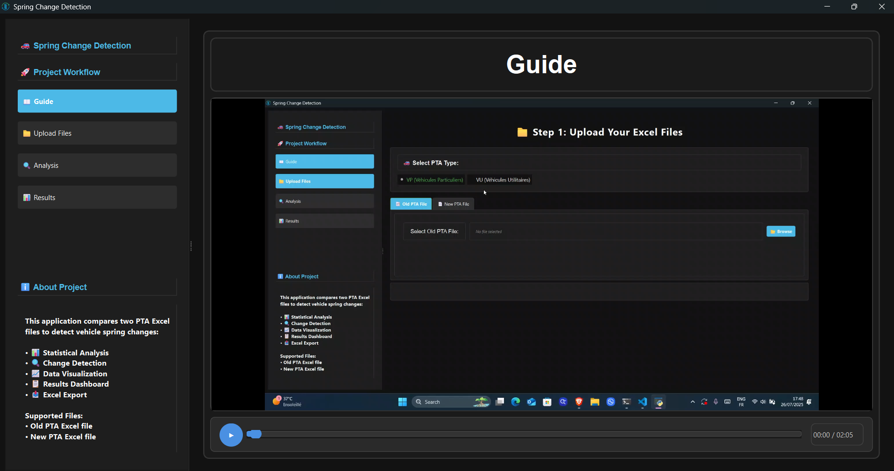
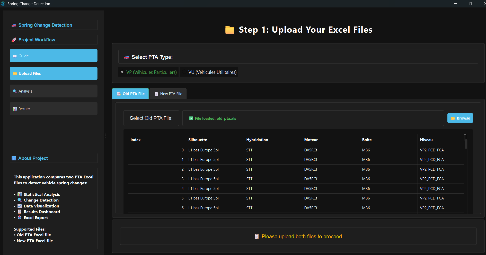
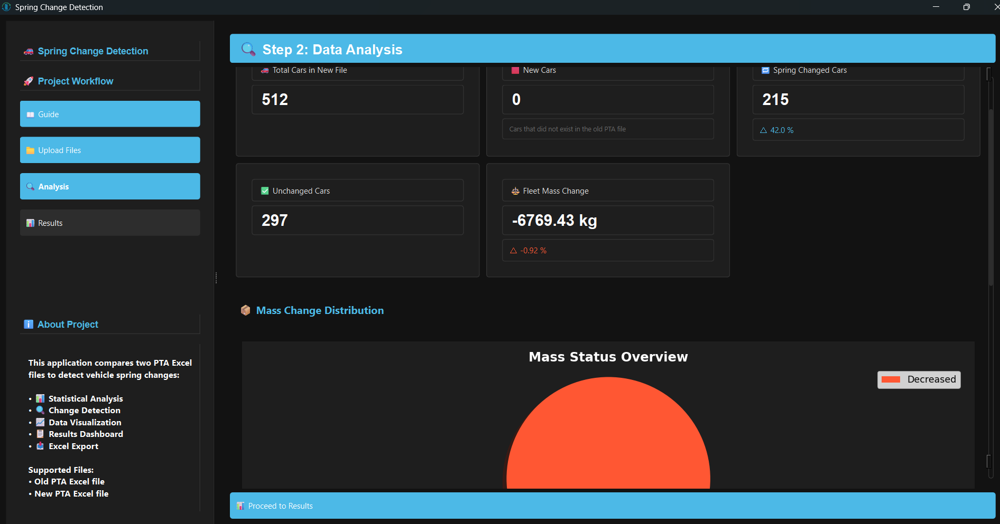
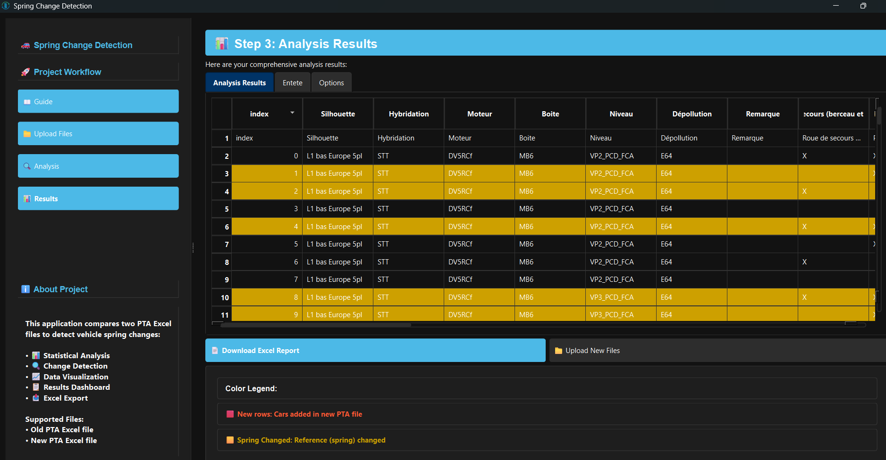

# Spring Change Detection Desktop Application

## Application Images


<sub>Step-by-step guide for using the app</sub>


<sub>Upload old and new PTA Excel files</sub>


<sub>Analyze and compare spring changes</sub>


<sub>View and export results</sub>

This is a desktop version of the Spring Change Detection application built with PySide6.

## Features

- Upload and analyze PTA Excel files
- Compare old and new files to detect spring changes
- Visualize statistics and changes
- Export results to Excel

## Setup

1. Install requirements:
```
pip install -r requirements.txt
```

2. Run the application:
```
python main.py
```

## Application Workflow

1. Upload old and new PTA Excel files
2. Run analysis to detect changes
3. View results with detailed statistics and visualizations
4. Export results to Excel

## Technology 

- Built with PySide6 for the desktop interface.
- Uses pandas, matplotlib, numpy, and openpyxl for data processing and visualization

## Pyinstaller command

```
pyinstaller --name="Spring Change Detection" --onefile --windowed --icon="resources/icons/app_icon.ico" --add-data "video;video" --add-data "resources;resources" --add-data "gui;gui" --add-data "utils;utils" --add-data "data_processing.py;." --hidden-import=gui --hidden-import=utils --hidden-import=PySide6 --hidden-import=pandas --hidden-import=openpyxl --hidden-import=xlrd --hidden-import=matplotlib.backends.backend_qt5agg main.py
```